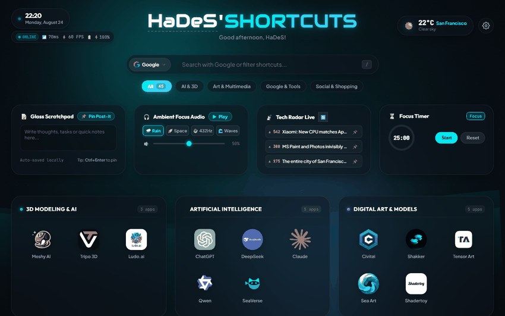
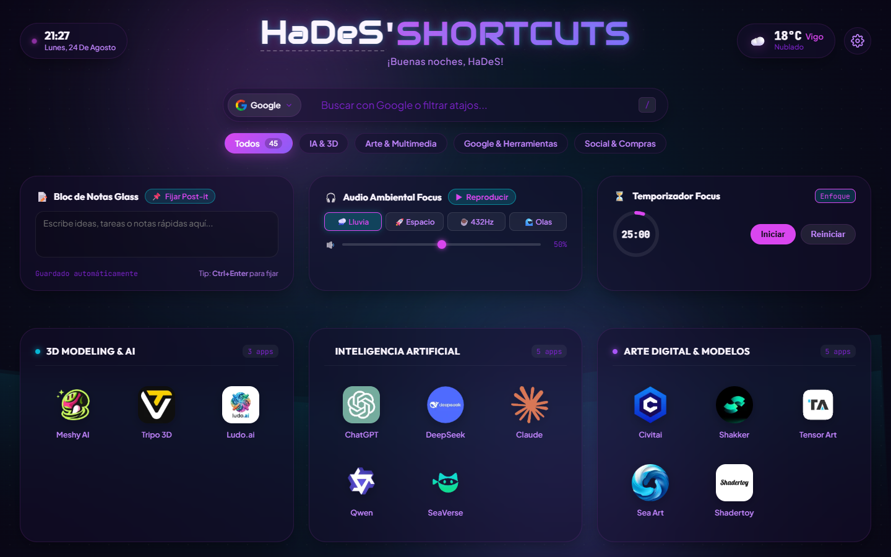
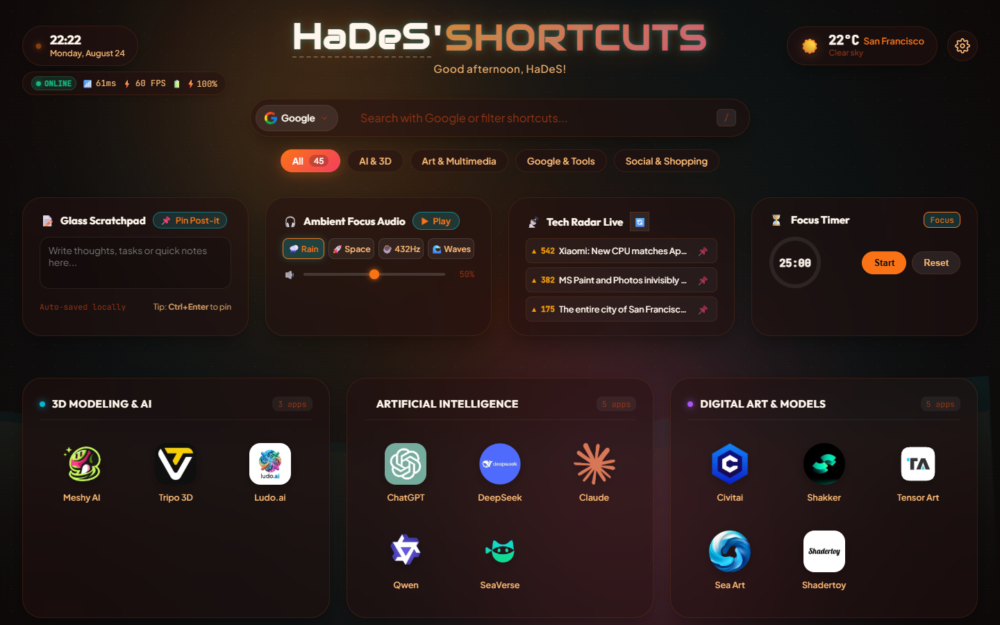
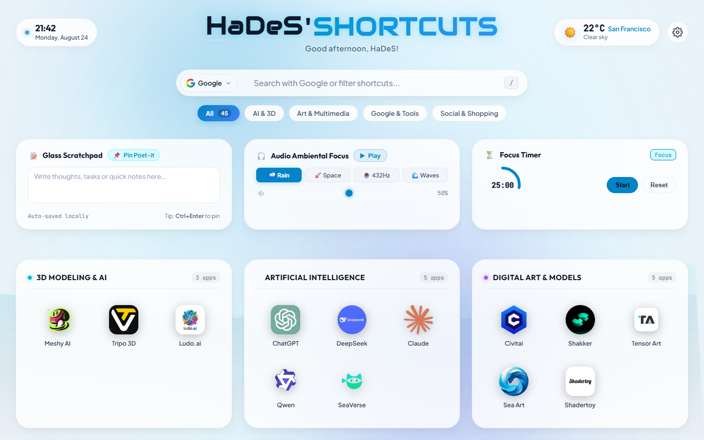
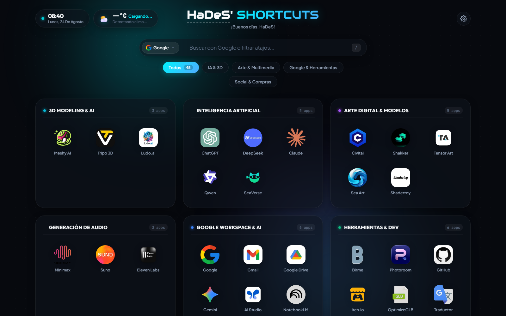
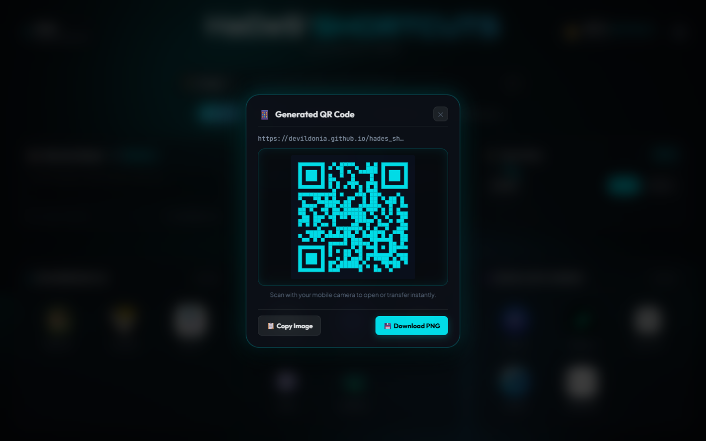

<div align="center">

# ⚡ HaDeS' Shortcuts · Next-Gen (v6.0)
### *A high-performance, ultra-aesthetic browser command center, productivity OS & startpage*

[](https://opensource.org/licenses/MIT)
[](https://devildonia.github.io/hades_shortcuts/)
[](https://devildonia.github.io/hades_shortcuts/)
[](https://developer.mozilla.org/en-US/)
[]()
[]()
[]()

<br />

<p align="center">
  <a href="https://devildonia.github.io/hades_shortcuts/">
    
  </a>
</p>

<br />



<br />
<br />

[Live Demo](https://devildonia.github.io/hades_shortcuts/) •
[Features](#-key-features) •
[DevTools & Bangs](#-devtools-omnibox--bang-commands) •
[Freeform & Post-its](#-freeform-canvas--floating-glass-post-its) •
[Ambient Audio](#-procedural-ambient-focus-sound-engine-0-kb-100-offline) •
[Macros](#-contextual-multi-action-macros-work-chill-3d-social) •
[E2EE Cloud Sync](#-zero-knowledge-encrypted-cloud-sync-e2ee) •
[Mini HUD Launcher](#-mini-hud-launcher-alt--space) •
[Gallery](#-visual-showcase) •
[Quick Start](#-quick-start) •
[Keyboard Shortcuts](#-keyboard-shortcuts) •
[Architecture](#-project-architecture-anti-god-file-modular-design)

<br />

</div>

---

## 📸 Visual Showcase

<div align="center">

| 🌌 **Deep Nebula Theme** | 🌅 **Sunset Amber Theme** |
| :---: | :---: |
|  |  |

| 💎 **Crystal Light Theme** | ⚙️ **Floating Glass Settings Modal** |
| :---: | :---: |
|  |  |

| 📱 **Interactive Glass QR Modal** | ⚡ **Cyber Neon Dashboard & Bento** |
| :---: | :---: |
|  |  |

</div>

---

## 🌟 Key Features

### 🛸 Radial HUD Action Wheel (360° Gestural Quick Access)
- **Holographic Circular Menu**: Press <kbd>Middle-Click</kbd> anywhere on the background or <kbd>Alt</kbd> + <kbd>C</kbd> to deploy an 8-node radial wheel orbiting your cursor:
  1. ⚡ **Top Favorites**: Instant launch of your most-used shortcut.
  2. 🎧 **Ambient Audio**: 1-click play/pause and soundscape toggle.
  3. ⏳ **Pomodoro Focus**: Quick start/pause timer.
  4. 📌 **Instant Post-it**: Creates a sticky note directly under your mouse cursor.
  5. 🌓 **Theme Switcher**: Instant day/night/cyber color cycling.
  6. 📱 **QR Generator**: Generates mobile QR code on the fly.
  7. 🔍 **Search Focus**: Jump to omnibox.
  8. ⚙️ **Floating Settings**: Open centered configuration modal.

### ☀️ Dynamic Solar Lighting & Circadian Rhythm Engine
- **Astronomical Solar Synthesis**: Calculates true solar elevation angle and solar time according to your geographic coordinates (e.g. San Francisco `37.7749`, `-122.4194`):
  - 🌅 **Golden Dawn (06:00 - 10:00)**: Warm amber gold tones and gentle sunrise glows.
  - ☀️ **High Noon (10:00 - 18:00)**: High-contrast sapphire cyan and crystal daylight mesh.
  - 🌆 **Cyber Twilight (18:00 - 22:00)**: Vibrant neon magenta, sunset violet, and twilight auroras.
  - 🌌 **Deep Space Midnight (22:00 - 06:00)**: Deep navy abyssal palette with starry micro-particles on the Aurora Canvas and blue-light eye protection.

### 📊 Cyberpunk System Telemetry & Network Health Capsule
- **Real-Time Network & Hardware Monitoring**:
  - 📶 **Live Latency Ping (ms)**: High-frequency non-blocking ping probe against global Cloudflare (`1.1.1.1`) and Google DNS endpoints.
  - 🔋 **Battery API**: Real-time battery charge percentage and charging status (`⚡95%`).
  - 🖥️ **Refresh Rate Monitor**: Real-time display refresh rate detector (60Hz, 120Hz, 144Hz).
  - 🌐 **Instant Offline Auto-Failover**: Dynamic detection of offline states with auto-cached local fallbacks.

### 📡 Live Tech Radar Bento Capsule
- **Real-Time Curated Tech & AI Streams**:
  - Direct live integration with **HackerNews Top Stories** and AI Radars via zero-backend asynchronous fetch with a 15-minute `localStorage` cache.
  - **1-Click Post-it Pinning**: Click 📌 on any trending headline to instantly pin it as a floating Glass Post-it for later reading.

### 🧠 Neural WebGPU & Semantic Vector Search Engine
- **In-Browser Local Semantic Vector Indexing**:
  - Instant cosine vector similarity matching across all titles, tags, and categories.
  - Type natural language queries like *"tools for generating 3d models"* or *"where to edit photos with ai"* to automatically highlight matching apps.
  - **Omnibox AI Assistant**:
    - `!ai <prompt>`: Instant client-side intelligent answers.
    - `!t <text>`: Fast multilingual translation helper.

### 📅 Bento Calendar & Agenda Hub («Universal Schedule Hub»)
- **Zero-Knowledge Universal Calendar Integration**:
  - 🔄 **Direct RFC 5545 iCal/ICS Parsing**: Client-side parsing of private iCal subscription URLs from Google Calendar, Microsoft Outlook, Apple iCloud, Nextcloud, or Proton Calendar (0 external proxy servers).
  - 🚨 **15-Minute Meeting Proximity Radar**: The bento card pulses with a neon warning halo (`.meeting-pulse-alert`) when an event is starting within 15 minutes.
  - 🚀 **1-Click Video Call Access**: Automatically parses and detects meeting links for **Google Meet**, **Zoom**, **Microsoft Teams**, and **Discord**.
  - 📐 **Full Bento Freeform Support**: Drag, resize (`tile-calendar`), or toggle visibility with `LayoutManager`.

### 🪐 Arc-Inspired Multi-Profile Spaces («Contextual Workspaces»)
- **Isolated Digital Profiles**: Switch between custom workflow environments in one click (<kbd>Alt</kbd> + <kbd>1</kbd> / <kbd>2</kbd> / <kbd>3</kbd>):
  - 💼 **Work & Dev Space**: Development shortcuts, Git tools, productivity apps, and clean daylight theme.
  - 🏠 **Personal & Leisure Space**: Social media, entertainment, shopping, and deep nebula theme.
  - 🎨 **3D & AI Media Space**: Fast access to 3D generators (Meshy, Tripo3D), GLSL shaders, audio/video generation, and cyber amber theme.
  - ⚡ **Instant In-Place Morphing**: Switches shortcuts, themes, scratchpad notes, and canvas positions without full page reload.

### 📈 100% Local Personal Analytics & Predictive Context Engine («My Dashboard Knows Me»)
- **Privacy-First Zero-Telemetry Intelligence**: All usage statistics are computed in-memory and sliding-window `localStorage` without sending a single byte to external servers:
  - 🔮 **Time-Aware Smart Suggestions**: Learns your daily habits and displays an interactive context chip (e.g. *"You usually open GitHub & Gmail at 09:00 — Launch now?"*).
  - 📊 **Procedural 7-Day SVG Activity Chart**: Ultra-lightweight native vector chart (< 2 KB, 0 external chart libraries) tracking your daily launch volume.
  - 🔥 **Productivity Streak & Peak Hour Detection**: Displays active day streaks and identifies your peak productivity windows (e.g. `10:00 AM`).
  - 🛡️ **Full Data Sovereignty**: 1-click JSON metrics export and full history wipe with confirmation.

### 🛠️ DevTools Omnibox & «Swiss Army Knife»
Transform your search bar into an instant utility suite:
- **`!uuid`**: Generates cryptographically secure UUIDv4 with 1-click clipboard copy.
- **`!color <value>`**: Full two-way color converter (HEX ⇄ RGB ⇄ HSL) with visual color chips.
- **`!b64 <text>` / `!b64d <hash>`**: Safe Base64 encoder and decoder in real time.
- **`!epoch` / `!time <timestamp>`**: Instant UNIX timestamp to readable ISO & relative date converter.
- **`!qr <text or url>`**: Generates high-resolution **Interactive Glass QR Modal** with PNG download and clipboard copy to seamlessly beam links to your smartphone.

### 🎨 Freeform Canvas & Floating Glass Post-its
- **Freeform Screen Positioning**: Move any category box, clock, weather, or notes anywhere across the 360° screen canvas with 1:1 cursor lock (`LayoutManager`).
- **Corner Resize Handles (`↘`)**: Dynamically resize width and height of any widget on the fly.
- **Glass Post-its**: Pin floating translucent sticky notes with custom neon color cycling, live in-place editing, and persistent positioning.

### 🔍 Smart HD Favicon Auto-Derivation
- When adding any URL (e.g. `https://figma.com`), the system automatically derives:
  - Official platform title (`Figma`).
  - High-Definition 128×128 px official favicon (`Google S2 / IconHorse HD API`).

### 🎧 Procedural Ambient Focus Sound Engine (0 KB, 100% Offline)
Pure mathematical acoustic synthesis using modern **Web Audio API** nodes (`AudioContext`, `BiquadFilterNode`, `BufferSourceNode`, `OscillatorNode`) with **0 KB external MP3s, zero streaming and 0% data consumption**:
- 🌧️ **Cyber Rain**: Algorithmic white/pink noise filtered through a 900 Hz low-pass filter with simulated randomized rainfall gusts.
- 🚀 **Deep Space (Brown Noise)**: Ultra-low frequency integration (200 Hz cutoff) designed for deep focus, sensory calming, and ADHD symptom relief.
- ☕ **Binaural Alpha Waves (432 Hz)**: Dual stereo sine wave oscillators (432 Hz left / 440 Hz right) producing a soothing 8 Hz Alpha brainwave beat for sustained creative flow.
- 🌊 **Cosmic Waves**: Low-frequency oscillator (0.1 Hz) slowly sweeping a resonant bandpass filter across pink noise to create a 10-second rhythmic ocean wave breathing cycle.
- 🎚️ **Smooth Linear Gain**: Prevents acoustic clicks on start/stop with progressive audio envelope ramping.

### ⚡ Contextual Multi-Action Macros (`!work`, `!chill`, `!3d`, `!social`)
Execute complete productivity routines with a single compound command:
- **`!work`**: Launches your dev apps (**GitHub + Claude + ChatGPT**), starts 25-min Pomodoro timer, and turns on 🌧️ Cyber Rain focus audio.
- **`!chill`**: Opens **YouTube + Suno**, resets timers, and engages 🌊 Cosmic Waves ambient sound.
- **`!3d`**: Launches **Meshy AI + Tripo 3D + Civitai** with 🚀 Deep Space Brown Noise.
- **`!social`**: Launches **Discord + X (Twitter) + Instagram** in background tabs.

### 🔒 Zero-Knowledge Encrypted Cloud Sync (E2EE)
- **Client-Side PBKDF2 + AES-256-GCM**: Derive 256-bit encryption keys from your master password with 100,000 PBKDF2 iterations using native `window.crypto.subtle`.
- **Private GitHub Gist Backup**: Safely synchronize all your custom shortcuts, 360° canvas positions, glass post-its, and theme settings across multiple devices with zero server tracking.

### 🌌 Reactive Aurora Canvas Mesh & Mini-HUD Launcher
- **Pointer-Reactive Fluid Mesh**: Generates multi-layer organic gradient wave curtains that subtly gravitate towards your mouse pointer.
- **Mini-HUD Launcher (<kbd>Alt</kbd> + <kbd>Space</kbd>)**: Compact glass launcher overlay with instant fuzzy search and quick app launch chips for ultra-minimalist workflows.

### 📝 Bento Mini-Widgets ("Liquid Cards")
- **Glass Scratchpad**: Fast persistent notepad with auto-save in `localStorage` for ideas, checklists, and tasks.
- **Pomodoro Focus Timer**: 25 min focus / 5 min break timer with SVG circular progress ring and gentle acoustic alarm chimes.
- **Ambient Audio Widget**: Integrated audio panel with 1-click sound presets and smooth volume control.
- **Configurable Visibility**: Toggle widgets on/off anytime from the *Layout & Shortcuts* settings tab.

### 🎨 Custom Theme Studio
- Live color picker in *Settings > Appearance* to customize primary accent and secondary glow colors with instant CSS variable re-calculation.

### 📥 Universal Browser Bookmarks Importer
- Import `bookmarks.html` exported from **Google Chrome, Mozilla Firefox, Microsoft Edge, Brave, or Safari** with one click.

### 📱 PWA & Offline Support
- Fully installable Progressive Web App (`manifest.json` + `sw.js`) for a distraction-free standalone desktop experience on Windows, macOS, and Linux.

---

## ⚡ DevTools Omnibox & Bang Commands Cheatsheet

| Command | Action / Destination Service | Example |
| :--- | :--- | :--- |
| `!work` | Routine: Open Dev Apps + Start Pomodoro + Rain Audio | `!work` |
| `!chill` | Routine: Open Media + Cosmic Waves Audio | `!chill` |
| `!3d` | Routine: Open 3D AI Apps + Space Audio | `!3d` |
| `!social` | Routine: Open Community & Social Apps | `!social` |
| `!uuid` | Generate UUIDv4 with 1-click copy | `!uuid` |
| `!color <val>` | Color converter & visual preview swatch | `!color #00f2fe` or `!color rgb(0,242,254)` |
| `!b64 <text>` | Real-time UTF-8 Base64 Encoder | `!b64 Cyberpunk 2077` |
| `!b64d <hash>` | Real-time Base64 Decoder | `!b64d Q3liZXJwdW5r` |
| `!time` / `!epoch` | UNIX epoch to local date & relative time | `!time` or `!epoch 1787589157` |
| `!qr <link>` | Generate Interactive Glass QR Code Modal | `!qr https://github.com` |
| `!yt <query>` | YouTube Search | `!yt lofi hip hop` |
| `!gh <query>` | GitHub Repositories | `!gh three.js` |
| `!w <query>` | Wikipedia (ES) | `!w James Webb` |
| `!r <query>` | Reddit Search | `!r webdev` |
| `!m <query>` | Google Maps | `!m Vigo, Spain` |
| `!civitai <query>` | Civitai Model Hub | `!civitai cyberpunk` |
| `!tr <text>` | Google Translate | `!tr thank you so much` |
| `!npm <pkg>` | NPM Registry | `!npm canvas-confetti` |
| `!ddg <query>` | DuckDuckGo Direct | `!ddg privacy tools` |
| `<math expr>` | Instant Math Calculator | `150 * 1.21` or `(45 + 15) / 2` |

---

## ⌨️ Keyboard Shortcuts

| Shortcut | Action |
| :--- | :--- |
| <kbd>Alt</kbd> + <kbd>Space</kbd> / <kbd>Ctrl</kbd> + <kbd>Space</kbd> | Open / Close Mini-HUD Launcher Overlay |
| <kbd>Ctrl</kbd> + <kbd>K</kbd> / <kbd>Cmd</kbd> + <kbd>K</kbd> | Focus the main search bar instantly |
| <kbd>/</kbd> | Focus search bar (when not typing in an input/textarea) |
| <kbd>Ctrl</kbd> + <kbd>,</kbd> | Open Settings Drawer |
| <kbd>Ctrl</kbd> + <kbd>Enter</kbd> | Pin note as floating Glass Post-it (in Scratchpad) |
| <kbd>Arrow Keys</kbd> (<kbd>↑</kbd> <kbd>↓</kbd> <kbd>←</kbd> <kbd>→</kbd>) | Navigate visible Bento cards |
| <kbd>Enter</kbd> | Launch highlighted shortcut, execute bang, or search engine |
| <kbd>ESC</kbd> | Clear search / Exit Edit Mode / Close open modals & HUD |

---

## 🚀 Quick Start

### Option 1: 🌐 Live Demo (Instant Web Preview)
Test and use the production dashboard directly in your browser without any installation:
👉 **[https://devildonia.github.io/hades_shortcuts/](https://devildonia.github.io/hades_shortcuts/)**

### Option 2: Direct Local File (Offline)
Simply clone the repository and double-click [`index.html`](index.html) in your browser. All assets, sounds, and dictionaries run 100% offline without any server setup.

### Option 3: Local HTTP Server
Run the included `local server.bat` script or launch a simple Python server:
```bash
# Launch a lightweight local server
python -m http.server 8080
```
Then visit `http://localhost:8080` in your favorite browser.

### Option 4: 🧩 Chrome / Edge / Brave Extension (Manifest V3)
Transform every new browser tab into HaDeS with 1 click:
1. Open `chrome://extensions/` in your Chromium-based browser (Chrome, Edge, Brave, Opera).
2. Enable **Developer Mode** (toggle in the top-right corner).
3. Click **Load unpacked** (*Cargar descomprimida*) and select this project folder.
4. Press <kbd>Ctrl</kbd> + <kbd>T</kbd> to enjoy your instant command center in every new tab!

---

## 🌍 Internationalization (i18n)

All interface strings, category titles, greetings, widgets, and shortcut tooltips are fully localized:

```
locales/
├── es.json   # Español 🇪🇸
├── en.json   # English 🇬🇧
├── fr.json   # Français 🇫🇷
└── de.json   # Deutsch 🇩🇪
```

---

## 🏛️ Project Architecture (Anti-God File Modular Design)

The project enforces a strict Single Responsibility Principle (SRP) with native ES6 modules under `/js/` (~50–270 lines each, 0 god files):

```
├── manifest.json            # PWA manifest for desktop installation
├── sw.js                    # Service Worker for offline cache & performance
├── index.html               # Clean, accessible semantic DOM structure
├── style.css                # Fluid CSS design tokens, themes & animations
├── locales/                 # i18n translation dictionaries (ES, EN, FR, DE)
├── docs/
│   └── screenshots/         # High-res previews & animated demo GIF
├── js/
│   ├── app.js               # Main orchestrator & lifecycle manager
│   ├── platform.js          # Universal platform abstraction (Web/PWA vs Extension)
│   ├── spaces.js            # Arc-inspired multi-profile spaces manager & hotkeys
│   ├── calendar-agenda.js   # RFC 5545 iCal/Google calendar parser & proximity radar
│   ├── personal-analytics.js# 100% local usage analytics, 7-day SVG chart & smart suggestions
│   ├── extension-api.js     # Native TopSites & background context menu bridge
│   ├── sw-extension.js      # Manifest V3 background service worker
│   ├── state.js             # Reactive central state & localStorage sync
│   ├── audio.js             # Procedural Web Audio API synthesizer (0 KB)
│   ├── ambient-audio.js     # Procedural focus ambient soundscapes (0 KB)
│   ├── aurora-canvas.js     # Reactive Aurora Canvas mesh & Mini-HUD launcher
│   ├── solar-engine.js      # Astronomical solar elevation & circadian lighting
│   ├── radial-hud.js        # 360° holographic action wheel & sub-orbital favs
│   ├── telemetry.js         # Real-time ping, battery, fps & offline monitor
│   ├── tech-radar.js        # Live HackerNews/AI tech radar bento capsule
│   ├── neural-search.js     # Local semantic vector search & AI assistant
│   ├── macros.js            # Compound multi-action macro & routine engine
│   ├── crypto-sync.js       # Zero-knowledge AES-256-GCM + GitHub Gist sync
│   ├── bangs.js             # Bang commands parser & safe math calculator
│   ├── devtools.js          # Built-in DevTools Omnibox & QR Code Generator
│   ├── postits.js           # Floating Glass Post-its manager
│   ├── layout.js            # Freeform Canvas & Corner Resize Engine (rAF)
│   ├── widgets.js           # Bento widgets manager (Scratchpad + Pomodoro)
│   ├── theme-studio.js      # Real-time custom theme color palette generator
│   ├── importer.js          # Universal HTML bookmarks parser (Chrome/Firefox)
│   ├── i18n.js              # Localization engine & dynamic loader
│   ├── weather.js           # Precision clock & Open-Meteo weather geocoder
│   ├── search.js            # Multi-engine search, bangs & arrow navigation
│   ├── render.js            # Dynamic Bento grid, cards & smart tooltips
│   ├── dragdrop.js          # Inner card reordering drag & drop manager
│   ├── shortcut-manager.js  # Add / Edit / Delete modal & HD Favicon engine
│   ├── backup.js            # JSON export, import & factory reset
│   └── settings.js          # Floating settings modal controller
├── iconos/                  # 48 optimized WebP icon assets (60x60)
└── sounds/                  # Haptic audio fallback assets
```

---

## 📄 License

This project is open-source and licensed under the [MIT License](LICENSE).
