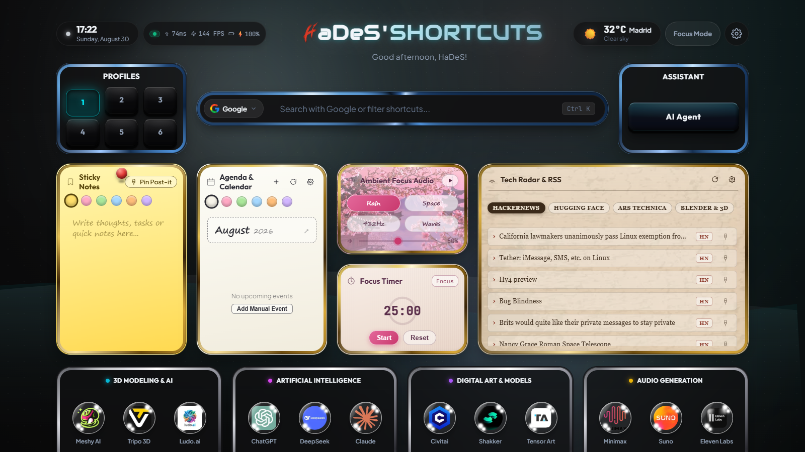
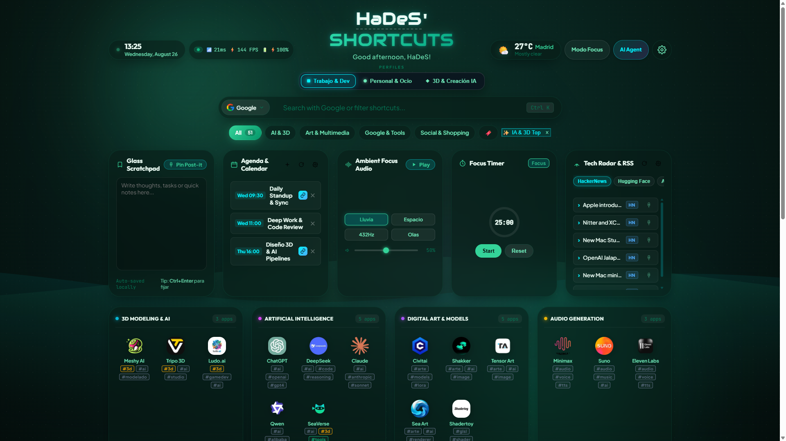
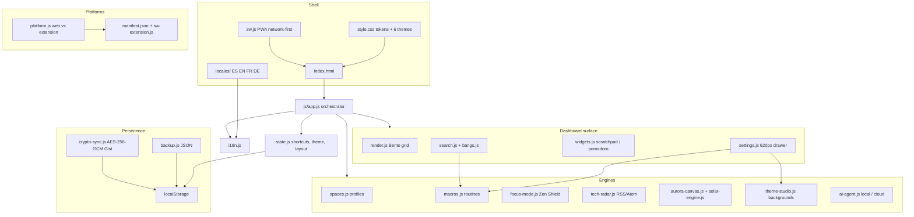

<div align="center">

# ⚡ HaDeS' Shortcuts · Next-Gen (v1.0.0-rc-1)
### *A high-performance, ultra-aesthetic browser command center, productivity OS & startpage*

[](https://opensource.org/licenses/MIT)
[](https://devildonia.github.io/hades_shortcuts/)
[](dist/hades-shortcuts-chrome-v1.0.0-rc-1.zip)
[](https://devildonia.github.io/hades_shortcuts/)
[](https://developer.mozilla.org/en-US/)
[]()
[]()

<br />

<p align="center">
  <a href="https://devildonia.github.io/hades_shortcuts/">
    
  </a>
</p>

<br />


<br />
<br />

[Live Demo](https://devildonia.github.io/hades_shortcuts/) ·
[Features](#-key-features) ·
[Architecture](#-architecture) ·
[Keyboard](#-keyboard-shortcuts) ·
[Bangs](#-devtools-omnibox--bang-commands) ·
[Quick Start](#-quick-start)

</div>

---

## What's new in v1.0.0-rc-1

First release candidate of 1.0. Chrome MV3 `version` stays numeric (`1.0.0`); the human tag is `1.0.0-rc-1` (`version_name`, cache-bust and zip).

- **Audit hardening**: single ESM graph (no duplicate engines), `openSafeUrl` on every live `window.open`, iCal `TZID` parsing, Focus/Pomodoro share remaining time, `alert()` replaced with toasts on Focus and iCal sync.
- **i18n parity**: embedded dictionaries match `locales/` (ES / EN / FR / DE); weather, user, iCal, RSS, smart-view, zen and AI modals use `data-i18n`.
- **PWA cache** `hades-shortcuts-v1-0-0-rc-1-cache`; startpage loads `js/app.js` (stale `js/bundle.js` removed).
- **Six visual themes**: Cyber Neon, Deep Nebula, Sunset Amber, **Abyss OLED**, **Jade Terminal**, Crystal Light.
- **Contained Command Center settings** (max 620px) with six tabs, including Habits & Analytics.
- **52 bundled shortcuts** across 10 Bento categories, including **Spotify** in Audio Generation, **eBay** in Shopping & Payments, and a full **Gaming** row.
- **Arc-style spaces** filter categories in place: Work & Dev (all), Personal & Leisure (social, shopping, gaming…), 3D & AI Creation (Gemini lives with Google Workspace).
- Empty category boxes stay hidden unless Edit Mode is on. Widget titles use inline SVG instead of emoji.
- Macro **Run / Edit** actions are equal-width Bento chips.

---

## Visual showcase

<div align="center">

| Cyber Neon | Deep Nebula |
| :---: | :---: |
|  |  |

| Sunset Amber | Crystal Light |
| :---: | :---: |
|  |  |

| Abyss OLED | Jade Terminal |
| :---: | :---: |
|  |  |

| Command Center Settings | Offline Canvas QR |
| :---: | :---: |
|  |  |

</div>

---

## Architecture

Vanilla HTML / CSS / ES modules. `js/app.js` boots the page; `js/state.js` is the reactive hub; everything else is a single-responsibility engine.



### Runtime flow

1. `index.html` loads design tokens and `js/app.js` as an ES module.
2. `app.js` hydrates `state`, locale, spaces, renderer, search, settings, widgets, and optional engines (Aurora, radar, calendar, AI).
3. `render.js` paints the Bento grid: **5 widget columns**, then **4 category columns**. Empty categories are skipped unless Edit Mode is on. The active space's `categoryIds` is a display filter — it does not replace the shortcut catalog.
4. Search, bangs, and macros all read the same `state.shortcuts` list.
5. Preferences live in `localStorage`. GitHub Gist sync encrypts that dashboard JSON with PBKDF2 + AES-256-GCM. API keys for OpenAI / Anthropic stay in `sessionStorage` for the tab only.

### Module map (`js/`)

| Module | Role |
| :--- | :--- |
| `app.js` | Lifecycle orchestrator |
| `state.js` | Reactive store, 10 categories, 52 default shortcuts |
| `i18n.js` | Dictionary loader + embedded fallbacks |
| `render.js` | Bento cards, tooltips, empty-category skip |
| `search.js` | Omnibox, engine picker, clear-X, bangs bridge |
| `spaces.js` | Work / Personal / 3D profiles |
| `settings.js` | Contained drawer, widget toggles, theme radios |
| `theme-studio.js` | Custom accents, Aurora / gradient / Unsplash / local wallpaper |
| `macros.js` | Visual routine studio + `!work` / `!focus` / `!chill` / `!3d` / `!social` |
| `focus-mode.js` | Deep Focus + social Zen Shield |
| `widgets.js` | Scratchpad + Pomodoro |
| `calendar-agenda.js` | Client-side iCal + manual events |
| `tech-radar.js` | RSS/Atom reader |
| `ambient-audio.js` / `audio.js` | Procedural soundscapes + haptic clicks |
| `aurora-canvas.js` / `solar-engine.js` | WebGL mesh + circadian lighting |
| `radial-hud.js` | Middle-click / Alt+C action wheel |
| `ai-agent.js` | Heuristic / Ollama / OpenAI / Anthropic drawer |
| `neural-search.js` | Token-overlap ranking (not WebGPU embeddings) |
| `crypto-sync.js` | E2EE Gist push/pull |
| `backup.js` | JSON export / import / factory reset |
| `devtools.js` | Offline Canvas QR + omnibox utilities |
| `platform.js` | Web vs Chrome MV3 differences |
| `sw-extension.js` | Extension background worker |

Supporting files: `manifest.json` (Chrome new-tab override), `site.webmanifest` + `sw.js` (PWA), `iconos/` (55 WebP shortcuts + PWA icons), `locales/`, `sounds/` (optional haptic fallbacks — synthesis is Web Audio).

---

## Key features

### Dynamic Background Studio
Three atmosphere modes from **Settings → Appearance**:
- **Aurora Canvas** — procedural mesh that follows the cursor and, optionally, solar elevation.
- **Solid / Gradient** — Midnight, Cyberpunk, Velvet, Emerald, OLED Black.
- **Image / Unsplash** — curated topics, random photo, local `FileReader` upload, custom URL, live **Blur** and **Dim** sliders.

### Visual Macro Studio
No-code routines in **Settings → Macros & Routines**: custom bang, title, shortcut checkboxes, ambient preset, Pomodoro action. Run them from the omnibox (`!gaming`) or the equal-width **Run / Edit** chips on each card.

### Bento Calendar & Agenda
Client-side RFC 5545 iCal (Google, Outlook, iCloud, Nextcloud, Proton). Manual events with title, time, and Meet / Zoom / Teams / Discord links. A neon pulse fires when a meeting is within 15 minutes.

### Widget visibility
Independent toggles in **Settings → Layout & Shortcuts**: Scratchpad, Calendar, Ambient Audio, Focus Timer, Tech Radar, System Telemetry capsule.

### Contextual AI agent
Ground-truth injection of shortcuts, tags, spaces, calendar, focus state, and radar headlines. Providers: local heuristic (zero keys), Ollama / LM Studio on `localhost:11434`, or OpenAI / Anthropic with a session-only key. Bang: `!ai` / `!ask`.

### Spaces
| Profile | Default filter | Default theme |
| :--- | :--- | :--- |
| Work & Dev | All 10 categories | Cyber Neon |
| Personal & Leisure | Social, Shopping, Gaming, Google, Tools, Video | Deep Nebula |
| 3D & AI Creation | 3D, AI, Art, Audio, Video, Google (Gemini) | Sunset Amber |

Switch with the header pills or <kbd>Alt</kbd>+<kbd>1</kbd> / <kbd>2</kbd> / <kbd>3</kbd>. Scratchpad text and last-used theme are remembered per space.

### Deep Focus & Zen Shield
`!work` / `!focus` or <kbd>Alt</kbd>+<kbd>F</kbd> starts a 25-minute session, dims noise, and intercepts Twitter/X, Instagram, Reddit, and TikTok with a 4-7-8 pacer.

### Tech Radar
In-browser RSS 2.0 / Atom 1.0 parser (Hacker News, Hugging Face, Ars Technica, Blender, custom feeds). 30-minute TTL. Pin any headline to a Glass Post-it.

### Smart views
Compound filters: `tag:<name>`, `#<name>`, `cat:<category>`, `is:fav`, `freq:top`. Pin a query as a permanent pill.

### Local analytics
In-memory + `localStorage` only. 7-day SVG chart, streak, peak hour, optional JSON export / wipe. No outbound telemetry.

### Radial HUD
<kbd>Middle-click</kbd> or <kbd>Alt</kbd>+<kbd>C</kbd>: favorites, ambient, Pomodoro, Post-it, theme cycle, QR, search, settings.

### Circadian lighting
Optional solar elevation coloring: Golden Dawn, High Noon, Cyber Twilight, Abyssal Midnight.

### Telemetry capsule
Latency probe, Battery API, refresh-rate detector, offline failover.

### Procedural audio (0 KB samples)
Web Audio API: Cyber Rain, Deep Space brown noise, 432 Hz binaural alpha, Cosmic Waves.

### Security & privacy
- QR codes are drawn on a 2D canvas — no third-party QR API.
- GitHub PATs live in `sessionStorage` and die with the tab.
- AES-256-GCM is used for **Gist dashboard sync**, not for LLM API keys.
- 52 bundled shortcuts; ranking in `neural-search.js` is local token overlap.

---

## DevTools omnibox & bang commands

| Command | Action | Example |
| :--- | :--- | :--- |
| `!work` / `!focus` | 25-min Deep Focus + Zen Shield | `!work` |
| `!chill` | Media apps + cosmic waves | `!chill` |
| `!3d` | 3D AI tools + deep space audio | `!3d` |
| `!social` | Community apps | `!social` |
| `!uuid` | UUIDv4 + clipboard | `!uuid` |
| `!color <val>` | Color preview | `!color #00f2fe` |
| `!b64` / `!b64d` | Base64 encode / decode | `!b64 Cyberpunk` |
| `!time` / `!epoch` | UNIX epoch helper | `!epoch 1787589157` |
| `!qr <link>` | Offline Canvas QR | `!qr https://github.com` |
| `!yt` / `!gh` / `!w` / `!r` / `!m` | YouTube, GitHub, Wikipedia, Reddit, Maps | `!gh three.js` |
| `!civitai` / `!tr` / `!npm` / `!ddg` | Model hub, Translate, NPM, DuckDuckGo | `!ddg privacy` |
| `<math>` | Instant calculator | `150 * 1.21` |

---

## Keyboard shortcuts

| Shortcut | Action |
| :--- | :--- |
| <kbd>Alt</kbd> + <kbd>1</kbd> / <kbd>2</kbd> / <kbd>3</kbd> | Switch spaces |
| <kbd>Alt</kbd> + <kbd>F</kbd> | Toggle Deep Focus |
| <kbd>Alt</kbd> + <kbd>C</kbd> / <kbd>Middle-Click</kbd> | Radial HUD |
| <kbd>Alt</kbd> + <kbd>Space</kbd> / <kbd>Ctrl</kbd> + <kbd>Space</kbd> | Mini-HUD launcher |
| <kbd>Ctrl</kbd> + <kbd>K</kbd> / <kbd>Cmd</kbd> + <kbd>K</kbd> | Focus search |
| <kbd>/</kbd> | Focus search (when not typing) |
| <kbd>Ctrl</kbd> + <kbd>,</kbd> | Open settings |
| <kbd>Ctrl</kbd> + <kbd>Enter</kbd> | Pin Scratchpad as Post-it |
| <kbd>↑</kbd> <kbd>↓</kbd> <kbd>←</kbd> <kbd>→</kbd> | Navigate Bento cards |
| <kbd>Enter</kbd> | Launch / bang / web search |
| <kbd>Esc</kbd> | Clear search, exit edit mode, close modals |

---

## Quick start

### Live demo
**[https://devildonia.github.io/hades_shortcuts/](https://devildonia.github.io/hades_shortcuts/)**

### Chrome / Edge / Brave (Manifest V3)
1. Download [`dist/hades-shortcuts-chrome-v1.0.0-rc-1.zip`](dist/hades-shortcuts-chrome-v1.0.0-rc-1.zip) or clone this repo.
2. Open `chrome://extensions/`, enable **Developer Mode**.
3. **Load unpacked** and select the project folder.
4. <kbd>Ctrl</kbd> + <kbd>T</kbd> opens the Command Center as your new tab.

### Local server
```bash
python -m http.server 8080
```
Then open `http://localhost:8080`.

---

## Internationalization

```
locales/
├── es.json   # Español
├── en.json   # English
├── fr.json   # Français
└── de.json   # Deutsch
```

UI chrome, greetings, widget copy, settings, and shortcut tooltips stay in parity across the four dictionaries.

---

## License

MIT. See [LICENSE](LICENSE).
